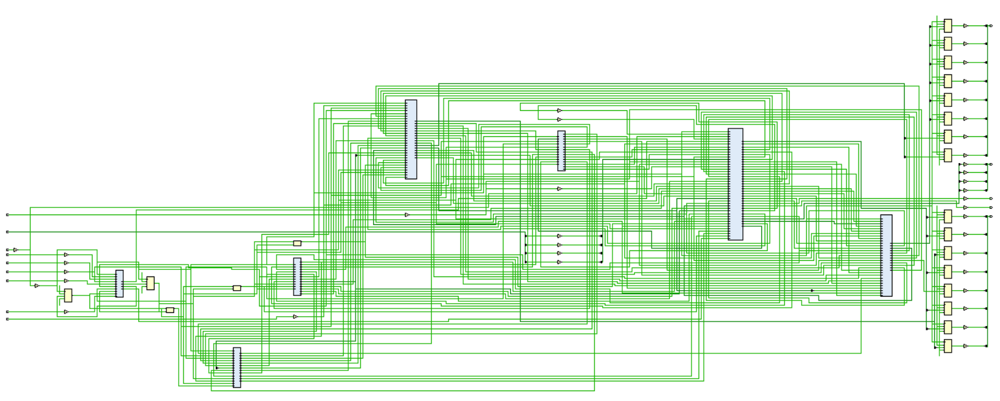
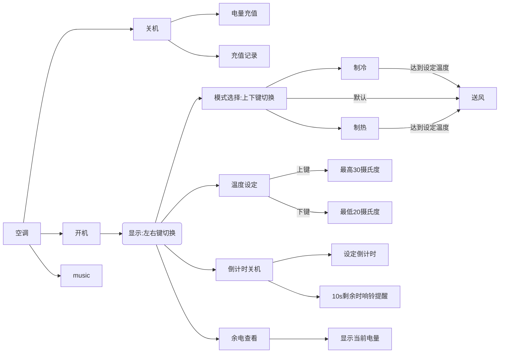

# <center>数字逻辑Project报告</center>

## <center> 	  ——智能空调（你说得都队）</center>

***

### 一、开发计划

#### 	（一）任务划分

* 刘仁杰：基本框架搭建, 任务划分, 空调初始化, 开机模式状态变更, 温度设定功能, 充电模块, 各模块整合, 代码重构, 系统综合;
* 朱世博：各状态显示模块、音乐模块、定时关机模块；
* 张皓淇：充电模块、小键盘、外挂音乐模块、电量充值记录查询模块。

#### 	（二）进度安排

11.28 确定任务划分，熟悉各自模块的设计要求
12.13 完成各个子模块的开发任务，开始进行模块整合
12.20 完成模块整合，开始进行bonus部分的开发

#### 	（三）执行记录

11.28  完成任务划分
11.29~12.6 不知如何上手, 加上其他课业压力, 停工一周
12.7 迫于DDL压力, 开始着手搭建框架
12.8 完成基本框架的搭建, 进一步明确分工 
12.16  完成各个子模块的开发任务，开始进行模块整合
12.17~12.19 模块整合受阻, 上板测试失败, 开始着手重构代码
12.20  完成模块整合，实现系统基本功能，开始进行bonus部分的开发
12.23 23：00 完成定时关机模块的开发，开始整合
12.24 1：00 完成电量充值记录查询模块的开发
12.24 4：00 定时关机模块整合完毕，音乐模块开发完毕
12.24 6：00 电量充值记录查询模块整合失败
12.24 6：30 完成演示视频的录制 

***

### 二、设计

#### 	（一）需求分析

##### 功能确定

> 1. 智能空调初始化、状态控制及信息显示功能
> 2. 智能开机状态的模式控制功能
> 3. 智能空调温度设定功能
> 4. 电量充值功能
> 5. 电量充值记录查询功能
> 6. 定时关机功能
> 7. 音乐

##### 输入输出设备及端口绑定

> 输入设备: 
> 
> * 矩阵键盘, 五个按键, 4个拨码开关
> 
> 输出设备: 
> 
> * 一个LED灯, 七段数码显示管
> 
> 端口绑定: 
> * 矩阵键盘对应充电量和定时关机设定
> 
> * 五个按键分别对应翻页操作显示信息的切换, 设定温度的上下调节, 制冷制热送风三种模式的上下切换, 剩余电量的显示, 设定定时关机的显示
> 
> * 四个拨码开关分别对应开关机, 系统初始化, 充电模式和设定关机时间的进入, 剩余电量查询
> 
> * 一个LED灯对应显示输出结束
> 
> * 七段数码显示管对应空调所有信息的显示

#### 	（二）系统结构图

> 


#### 	（三）系统执行流程


#### 	（四）子模块代码

```verilog
//顶层模块
module view_top(
    // 拨码开关(开关机, 1为开机, 0为关机), 板上时钟, 小键盘(1个4bit行), 五个小按钮(上下左右中)
    input on_off, rst, lookup, clk, [3:0] row,
    input up_level, down_level, left_level, right_level, middle_level, ifcharge,
    
    output reg [7:0] DIG,    //8个 扫描一个
    output reg [7:0] Y,      //输出的内容
    output [3:0] col,
    output charge_end,
    output beep
    );

    wire [1:0] mode; // 模式
    wire [11:0] setT; // 设定温度
    wire [11:0] envT; // 环境温度
    wire [11:0] elec; // 电量
    wire [11:0] charge; // 充电量
    wire [11:0] set_time; // 设置倒计时
    wire [11:0] count_down; // 倒计时
    wire [11:0] chargeInfo; // 充值记录

    reg [1:0] select = 2'b01; //01温度, 10电量, 11模式
    wire [7:0] DIG_t;
    wire [7:0] DIG_e;
    wire [7:0] DIG_m;
    wire [7:0] DIG_c;
    wire [7:0] DIG_d;
    wire [7:0] DIG_l;
    wire [7:0] Y_t;
    wire [7:0] Y_e;
    wire [7:0] Y_m;
    wire [7:0] Y_c;
    wire [7:0] Y_d;
    wire [7:0] Y_l;

    wire up, down, left, right, middle;
    wire ifon;
    wire shutdown;

    key_vibration vibration(clk, rst, {up_level, down_level, left_level, right_level, middle_level}, {up, down, left, right, middle});

    view_temp tempV( on_off, ifon, shutdown, rst, clk, envT, setT, DIG_t ,Y_t );
    view_elec elecV( on_off, rst, clk, elec, DIG_e , Y_e );
    view_mode modeV( on_off, rst, clk, mode, DIG_m , Y_m );
    view_charge chargeV(on_off, ifon, rst, clk, elec, charge, DIG_c, Y_c);
    view_time2 timeV(on_off, ifon, shutdown, rst, clk, set_time, count_down, DIG_d, Y_d);
    view_chargehistory history(rst, clk, chargeInfo, DIG_l, Y_l);

    // 与controller链接
    controller_top controller(on_off, rst, lookup, clk, row, up, down, left, 	right, middle, ifcharge, select, mode, setT, envT, elec, col, ifon, charge, 	charge_end, set_time, count_down, shutdown, beep, chargeInfo);

    always @(posedge clk) begin
        if (left && on_off) begin
            if (select == 3) begin
                select <= 0;
            end
            else begin
                select <= select + 1;
            end
        end
        else if (right && on_off) begin
            if (select == 0) begin
                select <= 3;
            end
            else begin
                select <= select - 1;
            end
        end
    end

    always @ (posedge clk) begin
        if (lookup) begin
            Y <= Y_l;
            DIG <= DIG_l;
        end
        else if (!(on_off && ifon && shutdown)) begin
            if (ifcharge) begin
                Y <= Y_c;
                DIG <= DIG_c;
            end
            else begin
                Y <= Y_t;
                DIG <= DIG_t;
            end
        end
        else begin
            if (select == 2'b00) begin
                Y <= Y_d;
                DIG <= DIG_d;
            end
            else if (select == 2'b01) begin
                Y <= Y_t;
                DIG <= DIG_t;
            end
            else if (select == 2'b10) begin
                Y <= Y_e;
                DIG <= DIG_e;
            end
            else if (select == 2'b11) begin
                Y <= Y_m;
                DIG <= DIG_m;
            end
        end
    end

endmodule

```

#### 防抖模块

```verilog
module key_vibration(
    input		  	 mclk,
	input		  	 rst_n,
	input	   [4:0] key,
	output reg [4:0] key_en
	);
	
	parameter DURATION = 50_000;                           //延时10ms	
	reg [15:0] cnt; 
	
	wire ken_enable;
	assign ken_enable = key[4] | key[3] | key[2] | key[1] | key[0]; //只要任意按键被按下，相应的按键进行消抖
	
	always @(posedge mclk or negedge rst_n)
	begin
		if(!rst_n)
			cnt <= 11'd0;
		else if(ken_enable == 1) begin
			if(cnt == DURATION)
				cnt <= cnt;
			else 
				cnt <= cnt + 1'b1;
			end
		else
			cnt <= 16'b0;
	end
	
	always @(posedge mclk or negedge rst_n) 
	begin
		if(!rst_n) key_en <= 5'd0;
		else if(key[0]) key_en[0] <= (cnt == DURATION-1'b1) ? 1'b1 : 1'b0;
		else if(key[1]) key_en[1] <= (cnt == DURATION-1'b1) ? 1'b1 : 1'b0;
		else if(key[2]) key_en[2] <= (cnt == DURATION-1'b1) ? 1'b1 : 1'b0;
		else if(key[3]) key_en[3] <= (cnt == DURATION-1'b1) ? 1'b1 : 1'b0;
		else if(key[4]) key_en[4] <= (cnt == DURATION-1'b1) ? 1'b1 : 1'b0;
		else key_en <= key_en;
	end
	
endmodule
```

#### 二进制-->BCD转换模块

```verilog
module Bin_BCD(
    input [9:0] binary,
    output [11:0] decimal
    );
    reg [3:0] hundreds;
    reg [3:0] tens;
    reg [3:0] ones;

    assign decimal = {hundreds[3:0], tens[3:0], ones[3:0]};

    integer i;
    always @(binary) begin
        hundreds = 4'd0;
        tens = 4'd0;
        ones = 4'd0;

        for (i = 9; i >= 0; i = i - 1) begin
            // 满5加3
            if (hundreds >= 5) begin
                hundreds = hundreds + 3;
            end
            if (tens >= 5) begin
                tens = tens + 3;
            end
            if (ones >= 5) begin
                ones = ones + 3;
            end

            // 向左移位
            hundreds = hundreds << 1;
            hundreds[0] = tens[3];
            tens = tens << 1;
            tens[0] = ones[3];
            ones = ones << 1;
            ones[0] = binary[i];
        end
    end
endmodule

```

#### 时钟分频模块

```verilog
module div_frequency(
    input clk,  //Y18
    input rst,  //复位
    output reg clkout
    );
    parameter period = 100000000;//1s
    reg [31:0] cnt;

    always @ (posedge clk or negedge rst)
    begin
    if (!rst) begin
        cnt <= 0;
        clkout <=0;
    end
    else begin
        if(cnt == (period>>1)-1)
        begin
            clkout <= ~clkout;
            cnt <= 0;
        end
        else
            cnt <= cnt+1;
    end
end
endmodule

```


#### 温度显示模块

```verilog
module view_temp(
    input on_off, ifon_elec, ifon_time,
    input rst,  //复位
    input clk, //Y18
    input [11:0] envT,  //环境温度
    input [11:0] setT,  //设定温度
    output [7:0] DIG,     //8个 扫描一个
    output [7:0] Y        //输出的内容
    );

    reg clkout;
    reg [31:0] cnt;
    reg [2:0] scan_cnt;

    parameter period = 200000; //500Hz
    reg [7:0] DIG_r;

    reg [3:0] bcd;
    reg [6:0] seg_out;
    reg dot;


    assign Y = {dot,(~seg_out[6:0])};
    assign DIG = ~DIG_r;

    //分频
    always @ (posedge clk or negedge rst)
    begin
        if (!rst) begin
            cnt <= 0;
            clkout <=0;
        end
        else begin
            if(cnt == (period>>1)-1)
            begin
                clkout <= ~clkout;
                cnt <= 0;
            end
            else
                cnt <= cnt+1;
        end
    end


    //扫描计数
    always @ (posedge clkout or negedge rst)
    begin
        if(!rst)
            scan_cnt <=0;
            else begin
                scan_cnt <= scan_cnt +1;
                if(scan_cnt == 3'd7) scan_cnt <=0;
            end    
    end


    //将输入转为对应位置的BCD码
    always @ (scan_cnt, setT, envT) begin
        case (scan_cnt)
            1 : bcd = setT[3:0];
            2 : bcd = setT[7:4];
            3 : bcd = setT[11:8];

            5 : bcd = envT[3:0];
            6 : bcd = envT[7:4];
            7 : bcd = envT[11:8];
            default: bcd = 4'b1111;
        endcase
    end

    //BCD码转输出字符
    always @ (bcd)
        begin
        case(bcd)
            4'b0000: seg_out = 7'b0111111;//0
            4'b0001: seg_out = 7'b0000110;//1
            4'b0010: seg_out = 7'b1011011;//2
            4'b0011: seg_out = 7'b1001111;//3                                 
            4'b0100: seg_out = 7'b1100110;//4
            4'b0101: seg_out = 7'b1101101;//5
            4'b0110: seg_out = 7'b1111101;//6
            4'b0111: seg_out = 7'b0100111;//7
            4'b1000: seg_out = 7'b1111111;//8
            4'b1001: seg_out = 7'b1101111;//9
            default :seg_out = 7'b0000000;//全灭
        endcase
    end

    //扫描 8选一
    always @ (scan_cnt, on_off) begin
        if (on_off && ifon_elec && ifon_time) begin
            case (scan_cnt)
                3'b000 : DIG_r = 8'b0000_0001;
                3'b001 : DIG_r = 8'b0000_0010;
                3'b010 : DIG_r = 8'b0000_0100;
                3'b011 : DIG_r = 8'b0000_1000;
                3'b100 : DIG_r = 8'b0001_0000;
                3'b101 : DIG_r = 8'b0010_0000;
                3'b110 : DIG_r = 8'b0100_0000;
                3'b111 : DIG_r = 8'b1000_0000;
            endcase
        end
        else begin
            case (scan_cnt)
                3'b000 : DIG_r = 8'b0000_0000;//？
                3'b001 : DIG_r = 8'b0000_0000;
                3'b010 : DIG_r = 8'b0000_0000;
                3'b011 : DIG_r = 8'b0000_0000;
                3'b100 : DIG_r = 8'b0001_0000;
                3'b101 : DIG_r = 8'b0010_0000;
                3'b110 : DIG_r = 8'b0100_0000;
                3'b111 : DIG_r = 8'b1000_0000;
            endcase
        end
    end

    always @(DIG_r) begin
        case (DIG_r)
            8'b0000_1000 : dot = 1'b0;
            8'b1000_0000 : dot = 1'b0;
            default: dot = 1'b1;
        endcase
    end
endmodule

```

#### 电量显示模块

```verilog
module view_elec(
    input on_off,
    input rst,  //复位
    input clk,  //Y18
    input [11:0] elec,  //电量
    output [7:0] DIG,  //8个 扫描一个
    output [7:0] Y    //输出的内容
    );

    reg clkout;
    reg [31:0] cnt;
    reg [2:0] scan_cnt;

    parameter period = 200000; //500Hz
    reg [6:0] Y_r;
    reg [7:0] DIG_r;

    reg [3:0] bcd;
    reg [6:0] seg_out;

    reg dot;

    assign Y = {dot,(~Y_r[6:0])};
    assign DIG = ~DIG_r;


    //分频
    always @ (posedge clk or negedge rst)
    begin
        if (!rst) begin
            cnt <= 0;
            clkout <=0;
        end
        else begin
            if(cnt == (period>>1) - 1)
            begin
                clkout <= ~clkout;
                cnt <= 0;
            end
            else
                cnt <= cnt+1;
        end
    end

    //扫描计数
    always @ (posedge clkout or negedge rst)
    begin
        if(!rst)
            scan_cnt <= 0;
            else begin
                scan_cnt <= scan_cnt + 1;
                if(scan_cnt == 4'b1000) scan_cnt <= 0;
            end    
    end

    //左侧三位 显示电量数字
    always @ (scan_cnt, elec)
        begin
            case (scan_cnt)
                5 : bcd = elec[3:0];
                6 : bcd = elec[7:4];
                7 : bcd = elec[11:8];       
            default: bcd = 4'b1111;
            endcase
        end

    //BCD转数字 
    //default 理论上到达不了
    always @ (bcd) 
        begin
        case(bcd)
            4'b0000: seg_out = 7'b0111111;//0
            4'b0001: seg_out = 7'b0000110;//1
            4'b0010: seg_out = 7'b1011011;//2
            4'b0011: seg_out = 7'b1001111;//3                                 
            4'b0100: seg_out = 7'b1100110;//4
            4'b0101: seg_out = 7'b1101101;//5
            4'b0110: seg_out = 7'b1111101;//6
            4'b0111: seg_out = 7'b0100111;//7
            4'b1000: seg_out = 7'b1111111;//8
            4'b1001: seg_out = 7'b1101111;//9
            default :seg_out = 7'b0000000;//全灭
        endcase
    end

    //扫描 8个显示选一个
    always @ (scan_cnt)
        begin
            case (scan_cnt)
                3'b000 : DIG_r = 8'b0000_0001;
                3'b001 : DIG_r = 8'b0000_0010;
                3'b010 : DIG_r = 8'b0000_0100;
                3'b011 : DIG_r = 8'b0000_1000;
                3'b100 : DIG_r = 8'b0001_0000;
                3'b101 : DIG_r = 8'b0010_0000;
                3'b110 : DIG_r = 8'b0100_0000;
                3'b111 : DIG_r = 8'b1000_0000;
            endcase
        end 

    //总输出显示
    always @ (scan_cnt, seg_out) begin
        case (scan_cnt)
                0 : Y_r = 7'b1110100;//h
                1 : Y_r = 7'b1000000;//-
                2 : Y_r = 7'b1101010;//w
                3 : Y_r = 7'b0000000;
                4 : Y_r = 7'b0000000;//kong
                5 : Y_r = seg_out;
                6 : Y_r = seg_out;
                7 : Y_r = seg_out;
                default: Y_r = 7'b0000000;
        endcase
    end

    always @(DIG_r) begin
        case (DIG_r)
            8'b1000_0000 : dot = 1'b0;
            default: dot = 1'b1;
        endcase
    end
endmodule
```

#### 模式显示模块

```verilog
module view_mode(
    input on_off,
    input rst,  //复位
    input clk,  //Y18
    input [1:0] mode, //模式
    output [7:0] DIG,  //8个 扫描一个
    output [7:0] Y    //输出的内容
    );
    reg clkout;
    reg [31:0] cnt;
    reg [2:0] scan_cnt;

    parameter period = 200000; //500Hz
    //parameter period = 2500000 // 40Hz 
    //parameter period = 5000000;
    reg [6:0] Y_r;
    reg [7:0] DIG_r;

    reg [7:0] char3;
    reg [7:0] char2;
    reg [7:0] char1;
    reg [7:0] char0;

    assign Y = {1'b1,(~Y_r[6:0])};
    assign DIG = ~DIG_r;

    //分频
    always @ (posedge clk or negedge rst)
    begin
        if (!rst) begin
            cnt <= 0;
            clkout <=0;
        end
        else begin
            if(cnt == (period>>1)-1)
            begin
                clkout <= ~clkout;
                cnt <= 0;
            end
            else
                cnt <= cnt+1;
        end
    end


    //扫描计数
    always @ (posedge clkout or negedge rst)
    begin
        if(!rst)
            scan_cnt <=0;
            else begin
                if(scan_cnt == 3'd7) scan_cnt <=0;
                scan_cnt <= scan_cnt +1;
            end    
    end

    //右侧4位输出内容
    always @ (mode)
        begin
            case(mode) //01 wind 10 cool 11 hot
                1:
                begin
                    char0 = 7'b0000000;
                    char1 = 7'b1010000;//r
                    char2 = 7'b0000100;//i
                    char3 = 7'b1110111;//a
                end
                2:
                begin
                    char0 = 7'b0000110;//l
                    char1 = 7'b1011100;//o
                    char2 = 7'b1011100;//o
                    char3 = 7'b1011000;//c
                end
                3:
                begin
                    char0 = 7'b0000000;//kong
                    char1 = 7'b1111000;//t
                    char2 = 7'b1011100;//o
                    char3 = 7'b1110100;//h
                end
                default
                    begin
                        char0 = 7'b0000000;//kong
                        char1 = 7'b0000000;//kong
                        char2 = 7'b0000000;//kong
                        char3 = 7'b0000000;//kong
                    end
                endcase
        end

    //扫描到的位置
    always @ (scan_cnt) begin
            case (scan_cnt)
                3'b000 : DIG_r = 8'b0000_0001;
                3'b001 : DIG_r = 8'b0000_0010;
                3'b010 : DIG_r = 8'b0000_0100;
                3'b011 : DIG_r = 8'b0000_1000;
                3'b100 : DIG_r = 8'b0001_0000;
                3'b101 : DIG_r = 8'b0010_0000;
                3'b110 : DIG_r = 8'b0100_0000;
                3'b111 : DIG_r = 8'b1000_0000;
            endcase
    end

    //扫描输出的内容
    always @ (scan_cnt, char0, char1, char2, char3) begin
        case (scan_cnt)
            7 : Y_r = 7'b1010101;//m
            6 : Y_r = 7'b1011100;//o
            5 : Y_r = 7'b1011110;//d
            4 : Y_r = 7'b1111001;//e
            0 : Y_r = char0;
            1 : Y_r = char1;
            2 : Y_r = char2;
            3 : Y_r = char3;
            default: Y_r = 7'b0000000;
        endcase
    end
endmodule
```


#### 充电显示模块

```verilog
module view_charge(
    input on_off, ifon_elec, rst, clk,
    input [11:0] elec,
    input [11:0] charge,

    output [7:0] DIG,
    output [7:0] Y
    );

    reg clkout;
    reg [31:0] cnt;
    reg [2:0] scan_cnt;

    parameter period = 200000; //500Hz
    reg [7:0] DIG_r;

    reg [3:0] bcd;
    reg [6:0] seg_out;
    reg dot;

    assign Y = {dot,(~seg_out[6:0])};
    assign DIG = ~DIG_r;

    //分频
    always @ (posedge clk or negedge rst)
    begin
        if (!rst) begin
            cnt <= 0;
            clkout <=0;
        end
        else begin
            if(cnt == (period>>1)-1)
            begin
                clkout <= ~clkout;
                cnt <= 0;
            end
            else
                cnt <= cnt+1;
        end
    end


    //扫描计数
    always @ (posedge clkout or negedge rst)
    begin
        if(!rst)
            scan_cnt <=0;
            else begin
                scan_cnt <= scan_cnt +1;
                if(scan_cnt == 3'd7) scan_cnt <=0;
            end    
    end


    //将输入转为对应位置的BCD码
    always @ (scan_cnt)
        begin
            case (scan_cnt)
                1 : bcd = charge[3:0];
                2 : bcd = charge[7:4];
                3 : bcd = charge[11:8];
                5 : bcd = elec[3:0];
                6 : bcd = elec[7:4];
                7 : bcd = elec[11:8];
                default: bcd = 4'b1111;
            endcase
        end

    //BCD码转输出字符
    always @ (bcd)
        begin
        case(bcd)
            4'b0000: seg_out = 7'b0111111;//0
            4'b0001: seg_out = 7'b0000110;//1
            4'b0010: seg_out = 7'b1011011;//2
            4'b0011: seg_out = 7'b1001111;//3                                 
            4'b0100: seg_out = 7'b1100110;//4
            4'b0101: seg_out = 7'b1101101;//5
            4'b0110: seg_out = 7'b1111101;//6
            4'b0111: seg_out = 7'b0100111;//7
            4'b1000: seg_out = 7'b1111111;//8
            4'b1001: seg_out = 7'b1101111;//9
            default :seg_out = 7'b0000000;//全灭
        endcase
    end

    //扫描 8选一
    always @ (scan_cnt) begin
        if (!(on_off && ifon_elec)) begin
            case (scan_cnt)
                3'b000 : DIG_r = 8'b0000_0001;
                3'b001 : DIG_r = 8'b0000_0010;
                3'b010 : DIG_r = 8'b0000_0100;
                3'b011 : DIG_r = 8'b0000_1000;
                3'b100 : DIG_r = 8'b0001_0000;
                3'b101 : DIG_r = 8'b0010_0000;
                3'b110 : DIG_r = 8'b0100_0000;
                3'b111 : DIG_r = 8'b1000_0000;
            endcase
        end
        else begin
            case (scan_cnt)
                3'b000 : DIG_r = 8'b0000_0000;
                3'b001 : DIG_r = 8'b0000_0000;
                3'b010 : DIG_r = 8'b0000_0000;
                3'b011 : DIG_r = 8'b0000_0000;
                3'b100 : DIG_r = 8'b0000_0000;
                3'b101 : DIG_r = 8'b0000_0000;
                3'b110 : DIG_r = 8'b0000_0000;
                3'b111 : DIG_r = 8'b0000_0000;
            endcase
        end
    end

    always @(DIG_r) begin
        case (DIG_r)
            8'b0000_1000 : dot = 1'b0;
            8'b1000_0000 : dot = 1'b0;
            default: dot = 1'b1;
        endcase
    end
endmodule

```

#### 倒计时显示模块

```verilog
module view_time2(
    input on_off, ifon_elec, ifon_time, rst, clk,
    input [11:0] settime,//设定时间 左侧显示
    input [11:0] curtime,//当前剩余时间 右侧显示

    output [7:0] DIG,
    output [7:0] Y
    );

    reg clkout;
    reg [31:0] cnt;
    reg [2:0] scan_cnt;

    parameter period = 200000; //500Hz
    reg [7:0] DIG_r;

    reg [3:0] bcd;
    reg [6:0] seg_out;
    reg dot;

    assign Y = {dot,(~seg_out[6:0])};
    assign DIG = ~DIG_r;

    //分频
    always @ (posedge clk or negedge rst)
    begin
        if (!rst) begin
            cnt <= 0;
            clkout <=0;
        end
        else begin
            if(cnt == (period>>1)-1)
            begin
                clkout <= ~clkout;
                cnt <= 0;
            end
            else
                cnt <= cnt+1;
        end
    end


    //扫描计数
    always @ (posedge clkout or negedge rst)
    begin
        if(!rst)
            scan_cnt <=0;
            else begin
                scan_cnt <= scan_cnt +1;
                if(scan_cnt == 3'd7) scan_cnt <=0;
            end    
    end


    //将输入转为对应位置的BCD码
    always @ (scan_cnt)
        begin
            case (scan_cnt)
                1 : bcd = curtime[3:0];
                2 : bcd = curtime[7:4];
                3 : bcd = curtime[11:8];
                5 : bcd = settime[3:0];
                6 : bcd = settime[7:4];
                7 : bcd = settime[11:8];
                default: bcd = 4'b1111;
            endcase
        end

    //BCD码转输出字符
    always @ (bcd)
        begin
        case(bcd)
            4'b0000: seg_out = 7'b0111111;//0
            4'b0001: seg_out = 7'b0000110;//1
            4'b0010: seg_out = 7'b1011011;//2
            4'b0011: seg_out = 7'b1001111;//3                                 
            4'b0100: seg_out = 7'b1100110;//4
            4'b0101: seg_out = 7'b1101101;//5
            4'b0110: seg_out = 7'b1111101;//6
            4'b0111: seg_out = 7'b0100111;//7
            4'b1000: seg_out = 7'b1111111;//8
            4'b1001: seg_out = 7'b1101111;//9
            default :seg_out = 7'b0000000;//全灭
        endcase
    end

    //扫描 8选一
    always @ (scan_cnt) begin
        if (on_off && ifon_elec && ifon_time) begin
            case (scan_cnt)
                3'b000 : DIG_r = 8'b0000_0001;
                3'b001 : DIG_r = 8'b0000_0010;
                3'b010 : DIG_r = 8'b0000_0100;
                3'b011 : DIG_r = 8'b0000_1000;
                3'b100 : DIG_r = 8'b0001_0000;
                3'b101 : DIG_r = 8'b0010_0000;
                3'b110 : DIG_r = 8'b0100_0000;
                3'b111 : DIG_r = 8'b1000_0000;
            endcase
        end
        else begin
            case (scan_cnt)
                3'b000 : DIG_r = 8'b0000_0000;
                3'b001 : DIG_r = 8'b0000_0000;
                3'b010 : DIG_r = 8'b0000_0000;
                3'b011 : DIG_r = 8'b0000_0000;
                3'b100 : DIG_r = 8'b0000_0000;
                3'b101 : DIG_r = 8'b0000_0000;
                3'b110 : DIG_r = 8'b0000_0000;
                3'b111 : DIG_r = 8'b0000_0000;
            endcase
        end
    end

    always @(DIG_r) begin
        case (DIG_r)
            default: dot = 1'b1;
        endcase
    end
endmodule

```

#### 显示历史充值记录

```verilog
module view_chargehistory(
    input rst, clk,
    input [11:0] chargeInfo,

    output [7:0] DIG,
    output [7:0] Y
    );

    reg clkout;
    reg [31:0] cnt;
    reg [2:0] scan_cnt;

    parameter period = 200000; //500Hz
    reg [7:0] DIG_r;

    reg [3:0] bcd;
    reg [6:0] seg_out;
    reg dot;


    assign Y = {dot,(~seg_out[6:0])};
    assign DIG = ~DIG_r;

    //分频
    always @ (posedge clk or negedge rst)
    begin
        if (!rst) begin
            cnt <= 0;
            clkout <=0;
        end
        else begin
            if(cnt == (period>>1)-1)
            begin
                clkout <= ~clkout;
                cnt <= 0;
            end
            else
                cnt <= cnt+1;
        end
    end


    //扫描计数
    always @ (posedge clkout or negedge rst)
    begin
        if(!rst)
            scan_cnt <=0;
            else begin
                scan_cnt <= scan_cnt +1;
                if(scan_cnt == 3'd7) scan_cnt <=0;
            end    
    end


    //将输入转为对应位置的BCD码
    always @ (scan_cnt) begin
        case (scan_cnt)
            5 : bcd = chargeInfo[3:0];
            6 : bcd = chargeInfo[7:4];
            7 : bcd = chargeInfo[11:8];
            default: bcd = 4'b1111;
        endcase
    end

    //BCD码转输出字符
    always @ (bcd)
        begin
        case(bcd)
            4'b0000: seg_out = 7'b0111111;//0
            4'b0001: seg_out = 7'b0000110;//1
            4'b0010: seg_out = 7'b1011011;//2
            4'b0011: seg_out = 7'b1001111;//3                                 
            4'b0100: seg_out = 7'b1100110;//4
            4'b0101: seg_out = 7'b1101101;//5
            4'b0110: seg_out = 7'b1111101;//6
            4'b0111: seg_out = 7'b0100111;//7
            4'b1000: seg_out = 7'b1111111;//8
            4'b1001: seg_out = 7'b1101111;//9
            default :seg_out = 7'b0000000;//全灭
        endcase
    end

    //扫描 8选一
    always @ (scan_cnt) begin
        case (scan_cnt)
                3'b000 : DIG_r = 8'b0000_0001;
                3'b001 : DIG_r = 8'b0000_0010;
                3'b010 : DIG_r = 8'b0000_0100;
                3'b011 : DIG_r = 8'b0000_1000;
                3'b100 : DIG_r = 8'b0001_0000;
                3'b101 : DIG_r = 8'b0010_0000;
                3'b110 : DIG_r = 8'b0100_0000;
                3'b111 : DIG_r = 8'b1000_0000;
        endcase
    end

    always @(DIG_r) begin
        case (DIG_r)
            //8'b0000_1000 : dot = 1'b0;
            8'b1000_0000 : dot = 1'b0;
            default: dot = 1'b1;
        endcase
    end
endmodule

```

#### 控制顶层

```verilog
module controller_top(
    // 拨码开关(开关机, 1为开机, 0为关机), 板上时钟, 小键盘(2个4bit行和列), 
    //五个小按钮(上下左右中), 当前状态(01温度, 10电量, 11模式)
    input on_off, rst, lookup, clock_Y18,
    input [3:0] row,
    input up, down, left, right, middle, mid,
    input [1:0] select,

    output [1:0] mode,
    output [11:0] innertemper,
    output [11:0] envirtemper,
    output [11:0] power,
    output [3:0] col,
    output ifon,
    output [11:0] chargevalue, 
    output input_end, // 充电结束
    output [11:0] count_time,
    output [11:0] time_remain,
    output ifon_count_time,
    output beep_out,
    output [11:0] chargeInfo
    );

    wire clk;
    wire [1:0] mod;
    wire [9:0] bin_inner; // 设定温度
    wire [9:0] bin_envir; // 环境温度
    wire [9:0] bin_power; // 电量
    wire [9:0] chargeElectricity; // 充电量
    wire [9:0] bin_count_time; //设置倒计时
    wire [9:0] bin_time_remain; // 倒计时
    wire [9:0] bin_chargeInfo;

    wire [15:0] numbers;//小键盘输出
    wire ifon_elec; // 电量监控开关

    assign mode = mod;
    assign ifon = ifon_elec;

    // 分频器生成一秒时钟信号
    div_frequency modeclk(clock_Y18, rst, clk);

    // 设置环境温度和模式
    envirtemper_mode setenvirtemper(on_off, ifon_elec, clock_Y18, clk, rst, up, down, bin_inner, select, bin_envir, mod);
    
    // 设定温度
    coretemper settemper(on_off, ifon_elec, clock_Y18, up, down, rst, select, bin_inner);
    
    // 电量
    corepower setpower(clock_Y18, on_off, rst, mod, chargeElectricity, input_end, bin_power, ifon_elec);

    // 小键盘
    keyboard_core readkeyboard(clock_Y18,rst,row,col,numbers);
    
    // 充电
    charge modecharge(clock_Y18, rst, mid, numbers, on_off, ifon_elec, chargeElectricity, input_end);

    //倒计时的时间
    countdown_input givetime(clock_Y18, rst, mid, numbers, on_off, ifon_elec, select, bin_count_time, input_time_end);

    //倒计时模块
    auto_off_top count_time_to_close(on_off, clock_Y18, rst, input_time_end, bin_count_time, ifon_count_time, beep_out, bin_time_remain);

    //充值记录模块
    memory memory_inst(lookup,rst,mid,chargeElectricity,clk,input_end,left,right,middle,bin_chargeInfo);
    
    // 二进制转BCD
    Bin_BCD trans_inner(bin_inner, innertemper);
    Bin_BCD trans_envir(bin_envir, envirtemper);
    Bin_BCD trans_power(bin_power, power);
    Bin_BCD trans_charge(chargeElectricity, chargevalue);
    Bin_BCD trans_count_time(bin_time_remain,time_remain);
    Bin_BCD trans_set_count_time(bin_count_time, count_time);
    Bin_BCD trans_chargeinfo(bin_chargeInfo, chargeInfo);

endmodule
```

#### 环境温度模块

```verilog
module envirtemper_mode(
    input on_off, ifon_elec, clock_Y18, clk, rst, up, down, [9:0] innertemper, [1:0] select, // 1s的时钟信号, 输入端触发信号, 复位信号(开机时自动复位或者设置成按下reset键复位)
    output [9:0]temperature, [1:0]mode // 10bit位表示20.0~30.0的温度,包含小数点, mode:2bit位表示模式, 00默认加一为01, 01显示air, 10显示cold, 11显示hot
    );
    reg [6:0] temper;
    reg [1:0] mod; // 记录mode变化并传给传出参数mode
    reg changemod;

    assign temperature = temper + 8'b11001000; // temper+20.0
    assign mode = mod;

    always @(posedge clk, negedge rst) begin
        if (~rst) begin
            temper <= 7'b0101000; // 复位为24.0
        end
        else if (mode == 2'b10) begin // 制冷模式下环境温度较高, 则环境温度每一秒减一
            if (temperature > innertemper) begin
                temper <= temper - 1;
            end
        end
        else if (mode == 2'b11) begin // 制热模式下环境温度较低, 则环境温度每一秒加一
            if (temperature < innertemper) begin
                temper <= temper + 1;
            end
        end
    end

    // 模式转换
    always @(posedge clock_Y18, negedge rst) begin
        if (~rst) begin
            mod <= 2'b01;
            changemod <= 1'b1;
        end
        else if (select == 2'b11 && on_off && ifon_elec) begin
            if (up) begin
                mod <= (mod + 1) == 3'b100 ? 2'b01 : (mod + 1);
                if (temperature != innertemper) begin
                    changemod <= 1'b1;
                end
            end
            else if (down) begin
                mod <= (mod - 1) == 2'b00 ? 2'b11 : (mod - 1);
                if (temperature != innertemper) begin
                    changemod <= 1'b1;
                end
            end
            else if(temperature == innertemper && changemod) begin
                mod <= 2'b01;
                changemod <= 0;
            end
        end
        else if(!(on_off && ifon_elec)) begin
            mod <= 2'b01;
        end
    end
endmodule

```

#### 设定温度模块

```verilog
module coretemper(
    // 输入端触发信号, 复位信号(开机时自动复位或者设置成按下reset键复位), 判断按上下键是否加减
    input on_off, ifon_elec, clock_Y18, increase, decrease, rst, [1:0] select,
    output [9:0]temperature // 10bit位表示20.0~30.0的温度,包含小数点
    );
    reg [6:0] temper;

    assign temperature = temper + 8'b11001000;

    always @(posedge clock_Y18, negedge rst) begin // increase信号上升沿, 温度加1
        if (~rst) begin // 复位
            temper <= 7'b0110010;
        end
        else if(on_off && ifon_elec) begin
            if (increase && temper < 7'b1100100 && select == 2'b01) begin // 如果是温度合法, 则加一
                temper <= temper + 4'b1010;
            end else if (decrease && temper > 7'b0000000 && select == 2'b01) begin  // 如果是温度合法, 则减一
                temper <= temper - 4'b1010;
            end
        end
    end
endmodule

```

#### 电量模块

```verilog
module corepower(
    // 时钟用于电量每秒的下降,on_off,1开机，0关机 mode用于模式的判定,01送风 10制冷 11制热
    //rst为初始化复位, tik为进入充值状态的触发，10位chargeElectricity表示充值的电量,input_end=1表示输入结束
    input clock_Y18, on_off, rst,
    input [1:0] mode,
    input [9:0]chargeElectricity,
    input input_end,
    
    output reg [9:0] power, // 10位电量值, 0~1000
    output ifon // 电量为0自动关机(1'b0)
    );
    reg [31:0] record1second;
    reg [31:0] record2second;
    reg on;
    reg ifinput; // 锁定输入

    assign ifon = on;

    always @(posedge clock_Y18, negedge rst) begin
        if (!rst) begin // 复位
            power <= 10'd100;
            record1second <= 1'b0;
            record2second <= 0;
            on <= 1'b1;
            ifinput <= 1;
        end
        else if (on_off && on) begin
            if (mode == 2'b10 || mode == 2'b11) begin // 制冷制热, 每1秒电量降1.0
                if (record1second == 100000000) begin
                    if (power < 10) begin
                        power <= 0;
                    end
                    else begin
                        power <= power - 10'd10;
                    end
                    record1second <= 0;
                end
                else begin
                    record1second <= record1second + 1;
                end
            end
            else if (mode == 2'b01) begin // 送风, 每两秒电量降0.5
                if (record2second == 200000000) begin
                    if (power < 5) begin
                        power <= 0;
                    end
                    else begin
                        power <= power - 10'd5;
                    end
                    record2second <= 0;
                end
                else begin
                    record2second <= record2second + 1;
                end
            end
            
            if (power == 0) begin
                on <= 1'b0;
            end
            else begin
                on <= 1'b1;
            end
        end
        else begin
            if (input_end == 1 && ifinput) begin // 位于关机模式且输入已经结束, 充电环节
                if (power + chargeElectricity > 10'd999) begin //若当前电量加充入电量大于999，则将电量设置为999
                    power <= 10'd999;
                end
                else begin //否则 当前电量加上充入电量
                    power <= power + chargeElectricity;
                end
                ifinput <= 0;
            end
            else if (input_end == 0) begin
                ifinput <= 1;
            end

            if (!on_off && power != 0) begin
                record1second <= 1'b0;
                record2second <= 0;
                on <= 1'b1;
            end
        end
    end
endmodule

```

#### 小键盘模块

```verilog
module kenboard_core(
    input clk, rst,
    input [3:0] row,
    output reg [3:0] col,
    output [15:0] keys
    );

    parameter NO_SCAN = 4'd0;//表示未扫描的状态
    parameter SCANING = 4'd1;//表示扫描的状态

    reg [3:0] state;

    reg[15:0] data;
    wire [15:0] data_out;

    reg[2:0] count; // 当按键在数个时钟周期中都处于按下的状态，则认为这是一次有效的输入

    keyboard_map key_mapping_inst(data_out, keys);//将生成的行列坐标信号映射成输出所需要的信号

    assign data_out=data;

    always @(posedge clk) begin
        if (rst) begin//复位
            col <= 4'b1111;
            state <= NO_SCAN;
            data <= 16'hFFFF;
            count <= 0;
        end
        else begin
            case (state)
                NO_SCAN: begin//若处于未扫描的状态，则进入扫描状态，开始扫描col0
                    state <= SCANING;
                    col <= 4'b1110;
                end
                SCANING: begin
                    case(col)

                        4'b1110: begin//扫描col0
                            if(count == 7) begin
                                data[3:0] <= row;
                                col <= 4'b0111;
                                count <= 0;
                            end
                            else count <= count + 1;

                        end

                        4'b0111: begin//扫描col3
                            if(count == 7) begin
                                data[15:12] <= row;
                                col <= 4'b1011;
                                count <= 0;
                            end
                            else count <= count + 1;
                        end

                        4'b1011: begin//扫描col2
                            if(count == 7) begin
                                data[11:8] <= row;
                                col <= 4'b1101;
                                count <= 0;
                            end
                            else count <= count + 1;
                        end
                        
                        4'b1101: begin//扫描col1
                            if(count == 7) begin
                                data[7:4] <= row;
                                col <= 4'b1110;
                                count <= 0;
                            end
                            else count <= count + 1;
                        end

                    endcase

                end

            endcase
        end
    end
endmodule

```

#### 小键盘映射模块

```verilog
module keyboard_map(
    input[15:0] key_in,
    output[15:0] key_out
    );

    assign key_out[13] = ~key_in[15]; // D
    assign key_out[12] = ~key_in[14]; // C
    assign key_out[11] = ~key_in[13]; // B
    assign key_out[10] = ~key_in[12]; // A
    assign key_out[15] = ~key_in[11];  // #
    assign key_out[9] = ~key_in[10];
    assign key_out[6] = ~key_in[9];
    assign key_out[3] = ~key_in[8];
    assign key_out[0] = ~key_in[7];
    assign key_out[8] = ~key_in[6];
    assign key_out[5] = ~key_in[5];
    assign key_out[2] = ~key_in[4];
    assign key_out[14] = ~key_in[3]; // *
    assign key_out[7] = ~key_in[2];
    assign key_out[4] = ~key_in[1];
    assign key_out[1] = ~key_in[0];
endmodule

```

#### 电量充值模块

```verilog
module charge(
    input clkin,
    input rst,charge,//16位numbers依次表示0-9，A,B,C,D,*,#;charge为1表示充值状态,rst复位,charge=1表示进入充电模式
    input [15:0]numbers,
    input on_off, ifon_elec,
    output reg [9:0]electricity,
    output input_end//分别表示充电电量和输入是否结束
    );
    reg inend;
    reg [3:0] temp;
    reg ifinput; // 锁定输入

    assign input_end = inend;

    wire clk;
    div div_in(clkin, rst, clk);

    always @(posedge clk, negedge rst) begin//若复位信号，充入电量归零
        if (~rst) begin
            temp <= 4'd12;
            inend <= 0;
            electricity <= 0;
            ifinput <= 1;
        end
        else begin
            if (electricity < 1000 && charge == 1 && !(on_off && ifon_elec)) begin//在充入电量小于1000，同时输入未结束的情况下
                if (numbers == 16'b0000_0000_0000_0001) begin//输入0
                    temp <= 4'd0;
                end
                else if (numbers==16'b0000_0000_0000_0010) begin//输入1
                    temp <= 4'd1;
                end
                else if (numbers==16'b0000_0000_0000_0100) begin//输入2
                    temp <= 4'd2;
                end
                else if (numbers==16'b0000_0000_0000_1000) begin//输入3
                    temp <= 4'd3;
                end
                else if (numbers==16'b0000_0000_0001_0000) begin//输入4
                    temp <= 4'd4;
                end
                else if (numbers==16'b0000_0000_0010_0000) begin//输入5
                    temp <= 4'd5;
                end
                else if (numbers==16'b0000_0000_0100_0000) begin//输入6
                    temp <= 4'd6;
                end
                else if (numbers==16'b0000_0000_1000_0000) begin//输入7
                    temp <= 4'd7;
                end
                else if (numbers==16'b0000_0001_0000_0000) begin//输入8
                    temp <= 4'd8;
                end
                else if (numbers==16'b0000_0010_0000_0000) begin//输入9
                    temp <= 4'd9;
                end
                else if (numbers==16'b0000_0100_0000_0000) begin//输入A,停止输入
                    temp <= 4'd10;
                    inend<=1;
                end
                else if (numbers==16'b0001_0000_0000_0000) begin//输入C,清空充电电量
                    temp <= 4'd11;
                    electricity <= 0;
                    inend<=0;
                end
                else begin
                    temp <= 4'd12;
                    ifinput <= 1;
                end

                if(ifinput == 1 && temp != 4'd12 && temp != 4'd10 && temp != 4'd11 && electricity * 10 + temp < 1000) begin
                    ifinput <= 0;
                    electricity <= electricity * 10 + temp;
                end

            end
        end
    end

endmodule

```

#### 倒计时关机输入模块

```verilog
module countdown_input(
    input clkin,
    input rst,charge,//16位numbers依次表示0-9，A,B,C,D,*,#;charge为1表示设定倒计时状态,rst复位,charge=1表示进入设定倒计时模式
    input [15:0]numbers,
    input on_off, ifon_elec,
    input [1:0] select,
    output reg [9:0]electricity,
    output input_end//分别表示设定倒计时是否结束
    );
    reg inend;
    reg [3:0] temp;
    reg ifinput; // 锁定输入

    assign input_end = inend;

    wire clk;
    div div_in(clkin, rst, clk);

    always @(posedge clk, negedge rst) begin//若复位信号，倒计时归零
        if (~rst) begin
            temp <= 4'd12;
            inend <= 0;
            electricity <= 0;
            ifinput <= 1;
        end
        else begin
            if (electricity < 1000 && charge == 1 && on_off && ifon_elec && select == 0) begin//在设定时间小于1000，同时输入未结束的情况下
                if (numbers == 16'b0000_0000_0000_0001) begin//输入0
                    temp <= 4'd0;
                end
                else if (numbers==16'b0000_0000_0000_0010) begin//输入1
                    temp <= 4'd1;
                end
                else if (numbers==16'b0000_0000_0000_0100) begin//输入2
                    temp <= 4'd2;
                end
                else if (numbers==16'b0000_0000_0000_1000) begin//输入3
                    temp <= 4'd3;
                end
                else if (numbers==16'b0000_0000_0001_0000) begin//输入4
                    temp <= 4'd4;
                end
                else if (numbers==16'b0000_0000_0010_0000) begin//输入5
                    temp <= 4'd5;
                end
                else if (numbers==16'b0000_0000_0100_0000) begin//输入6
                    temp <= 4'd6;
                end
                else if (numbers==16'b0000_0000_1000_0000) begin//输入7
                    temp <= 4'd7;
                end
                else if (numbers==16'b0000_0001_0000_0000) begin//输入8
                    temp <= 4'd8;
                end
                else if (numbers==16'b0000_0010_0000_0000) begin//输入9
                    temp <= 4'd9;
                end
                else if (numbers==16'b0000_0100_0000_0000) begin//输入A,停止输入
                    temp <= 4'd10;
                    inend<=1;
                end
                else if (numbers==16'b0001_0000_0000_0000) begin//输入C,清空充电电量
                    temp <= 4'd11;
                    electricity <= 0;
                    inend<=0;
                end
                else begin
                    temp <= 4'd12;
                    ifinput <= 1;
                end

                if(ifinput == 1 && temp != 4'd12 && temp != 4'd10 && temp != 4'd11) begin
                    ifinput <= 0;
                    electricity <= electricity * 10 + temp;
                end

            end
        end
    end

endmodule


```

#### 倒计时关机顶层模块

```verilog
module auto_off_top(
    input on_off,
    input clock_Y18, // Y18
    input rst, // 复位
    input confirm,
    input [9:0] ctime, // 倒计时的时间
    output reg shutdown, // 1开机
    output beep, //输出的音乐
    output reg [9:0] count_down
    );

    reg rst_b;
    reg [31:0] num;
    reg temp;

    beep beep_ring(clock_Y18, rst_b, beep);

    always @ (posedge clock_Y18 or negedge rst) begin
        if(~rst) begin
            count_down <= 0;
            num <= 0;
            shutdown <= 1;
            rst_b <= 0;
            temp <= 0;
        end
        else if (confirm == 1) begin
            count_down <= ctime;
            temp <= 1;
        end
        else begin
            if (count_down != 0) begin
                if (num < 100000000) begin
                    num <= num + 1;
                end
                else if(num == 100000000) begin
                    count_down <= count_down - 1;
                    num <= 0;
                end
            end
            
            if (count_down == 10) begin
                rst_b <= 1;
            end

            if (count_down == 0 && temp) begin
                shutdown <= 0;
                temp <= 0;
                rst_b <= 0;
            end

            if (!on_off) begin
                count_down <= 0;
                num <= 0;
                shutdown <= 1;
                rst_b <= 0;
                temp <= 0;
            end
        end
    end

endmodule

```

#### 剩余10s蜂鸣器提示顶层模块

```verilog
module auto_off_top(
    input on_off,
    input clock_Y18, // Y18
    input rst, // 复位
    input confirm,
    input [9:0] ctime, // 倒计时的时间
    output reg shutdown, // 1开机
    output beep, //输出的音乐
    output reg [9:0] count_down
    );

    reg rst_b;
    reg [31:0] num;
    reg temp;

    beep beep_ring(clock_Y18, rst_b, beep);

    always @ (posedge clock_Y18 or negedge rst) begin
        if(~rst) begin
            count_down <= 0;
            num <= 0;
            shutdown <= 1;
            rst_b <= 0;
            temp <= 0;
        end
        else if (confirm == 1) begin
            count_down <= ctime;
            temp <= 1;
        end
        else begin
            if (count_down != 0) begin
                if (num < 100000000) begin
                    num <= num + 1;
                end
                else if(num == 100000000) begin
                    count_down <= count_down - 1;
                    num <= 0;
                end
            end
            
            if (count_down == 10) begin
                rst_b <= 1;
            end

            if (count_down == 0 && temp) begin
                shutdown <= 0;
                temp <= 0;
                rst_b <= 0;
            end

            if (!on_off) begin
                count_down <= 0;
                num <= 0;
                shutdown <= 1;
                rst_b <= 0;
                temp <= 0;
            end
        end
    end

endmodule
```

#### 蜂鸣器顶层模块

```verilog
module beep(clk, rst_n, beep);
     input clk, rst_n;           //输入100Mhz时钟信号,复位信号
     output beep;            //输出的方波
     
     wire clk_1M, time_finsh;    //1Mhz时钟信号线，0.25s时间计数标记位
     wire [6:0]addr;             //rom地址线
     wire [7:0]rom_data;         //rom数据线
     wire [10:0]music_data;      //rom数据解码数据线
     
     //1M_Hz时间分频模块
     div_frequency #(100)my_time_1MHz_inst (             
         .rst(rst_n),
         .clk(clk),
         .clkout(clk_1M)
     );
     
     //0.25s时间计数器模块
     div_frequency #(625000)time_counter_inst(
         .rst(rst_n),
         .clk(clk_1M),
         .clkout(time_finsh)
     );  
         
     //ROM地址发生器
     addr_gen addr_gen_inst(         
         .clk(clk_1M),
         .rst_n(rst_n),
         .addr(addr),
         .time_finsh(time_finsh)
     );  
     
     //ROM模块
     my_rom my_rom_inst(             
         .address(addr),
         .q(rom_data)
     );
     
     //解码模块
     decode decode_inst(             
         .clk(clk_1M),
         .rst_n(rst_n),  
         .rom_data(rom_data),
         .music_data(music_data)
     );                  
     
     //音乐发生器模块
     music_gen music_gen_inst(       
         .clk(clk_1M),
         .rst_n(rst_n),
         .music_data(music_data),
         .beep(beep)
     );                  
         
 endmodule
```

#### ROM选择模块

```verilog
module addr_gen(clk, rst_n, addr, time_finsh);
                         
     input clk, rst_n;   //输入1Mhz时钟信号，复位信号
     input time_finsh;   //输入时间计数标记位（每0.25s变高电平一次）
     output reg [6:0]addr; //输出给ROM的地址信号
     
     always@(posedge clk or negedge rst_n)
     begin
         if(!rst_n)
             addr    <=  7'd0;   //输出给ROM的地址信号复位
         else    if(time_finsh) //输出给ROM的地址信号自加1（每0.25s自加1）
             addr    <=  addr    +   1'd1;   
         else
             addr    <=  addr;       //未够0.25s,ROM的地址信号不变
     end
     
 endmodule
```

#### ROM数据记录模块

```verilog

module my_rom(
input [6:0] address,
output reg  [7:0] q
    );
    reg [7:0] my_memory [0:127];

initial
begin
my_memory[0] = 8'h25;
my_memory[1] = 8'h41;
my_memory[2] = 8'h41;
my_memory[3] = 8'h42;
my_memory[4] = 8'h41;
my_memory[5] = 8'h27;
my_memory[6] = 8'h26;
my_memory[7] = 8'h26;
my_memory[8] = 8'h26;
my_memory[9] = 8'h42;
my_memory[10] = 8'h42;
my_memory[11] = 8'h43;
my_memory[12] = 8'h42;
my_memory[13] = 8'h41;
my_memory[14] = 8'h27;
my_memory[15] = 8'h25;
my_memory[16] = 8'h25;
my_memory[17] = 8'h43;
my_memory[18] = 8'h43;
my_memory[19] = 8'h44;
my_memory[20] = 8'h43;
my_memory[21] = 8'h42;
my_memory[22] = 8'h41;
my_memory[23] = 8'h26;
my_memory[24] = 8'h25;
my_memory[25] = 8'h25;
my_memory[26] = 8'h26;
my_memory[27] = 8'h42;
my_memory[28] = 8'h27;
my_memory[29] = 8'h41;
my_memory[30] = 8'h41;
my_memory[31] = 8'h25;
my_memory[32] = 8'h41;
my_memory[33] = 8'h41;
my_memory[34] = 8'h41;
my_memory[35] = 8'h27;
my_memory[36] = 8'h27;
my_memory[37] = 8'h27;
my_memory[38] = 8'h41;
my_memory[39] = 8'h27;
my_memory[40] = 8'h26;
my_memory[41] = 8'h25;
my_memory[42] = 8'h25;
my_memory[43] = 8'h42;
my_memory[44] = 8'h43;
my_memory[45] = 8'h42;
my_memory[46] = 8'h41;
my_memory[47] = 8'h45;
my_memory[48] = 8'h25;
my_memory[49] = 8'h25;
my_memory[50] = 8'h25;
my_memory[51] = 8'h26;
my_memory[52] = 8'h42;
my_memory[53] = 8'h27;
my_memory[54] = 8'h41;
my_memory[55] = 8'h41;
my_memory[56] = 8'h41;

my_memory[56] = 8'h25;
my_memory[57] = 8'h41;
my_memory[58] = 8'h41;
my_memory[59] = 8'h42;
my_memory[60] = 8'h41;
my_memory[61] = 8'h27;
my_memory[62] = 8'h26;
my_memory[63] = 8'h26;
my_memory[64] = 8'h26;
my_memory[65] = 8'h42;
my_memory[66] = 8'h42;
my_memory[67] = 8'h43;
my_memory[68] = 8'h42;
my_memory[69] = 8'h41;
my_memory[70] = 8'h27;
my_memory[71] = 8'h25;
my_memory[72] = 8'h25;
my_memory[73] = 8'h43;
my_memory[74] = 8'h43;
my_memory[75] = 8'h44;
my_memory[76] = 8'h43;
my_memory[77] = 8'h42;
my_memory[78] = 8'h41;
my_memory[79] = 8'h26;
my_memory[80] = 8'h25;
my_memory[81] = 8'h25;
my_memory[82] = 8'h26;
my_memory[83] = 8'h42;
my_memory[84] = 8'h27;
my_memory[85] = 8'h41;
my_memory[86] = 8'h41;
my_memory[87] = 8'h25;
my_memory[88] = 8'h41;
my_memory[89] = 8'h41;
my_memory[90] = 8'h41;
my_memory[91] = 8'h27;
my_memory[92] = 8'h27;
my_memory[93] = 8'h27;
my_memory[94] = 8'h41;
my_memory[95] = 8'h27;
my_memory[96] = 8'h26;
my_memory[97] = 8'h25;
my_memory[98] = 8'h25;
my_memory[99] = 8'h42;
my_memory[100] = 8'h43;
my_memory[101] = 8'h42;
my_memory[102] = 8'h41;
my_memory[103] = 8'h45;
my_memory[104] = 8'h25;
my_memory[105] = 8'h25;
my_memory[106] = 8'h25;
my_memory[107] = 8'h26;
my_memory[108] = 8'h42;
my_memory[109] = 8'h27;
my_memory[110] = 8'h41;
my_memory[111] = 8'h41;
my_memory[112] = 8'h41;

my_memory[113] = 8'h25;
my_memory[114] = 8'h41;
my_memory[115] = 8'h41;
my_memory[116] = 8'h42;
my_memory[117] = 8'h41;
my_memory[118] = 8'h27;
my_memory[119] = 8'h26;
my_memory[120] = 8'h26;
my_memory[121] = 8'h26;
my_memory[122] = 8'h42;
my_memory[123] = 8'h42;
my_memory[124] = 8'h43;
my_memory[125] = 8'h42;
my_memory[126] = 8'h41;
my_memory[127] = 8'h27;


end

always @ (address)
    begin
        case (address)
7'd0: q = my_memory[0];
7'd1: q = my_memory[1];
7'd2: q = my_memory[2];
7'd3: q = my_memory[3];
7'd4: q = my_memory[4];
7'd5: q = my_memory[5];
7'd6: q = my_memory[6];
7'd7: q = my_memory[7];
7'd8: q = my_memory[8];
7'd9: q = my_memory[9];
7'd10: q = my_memory[10];
7'd11: q = my_memory[11];
7'd12: q = my_memory[12];
7'd13: q = my_memory[13];
7'd14: q = my_memory[14];
7'd15: q = my_memory[15];
7'd16: q = my_memory[16];
7'd17: q = my_memory[17];
7'd18: q = my_memory[18];
7'd19: q = my_memory[19];
7'd20: q = my_memory[20];
7'd21: q = my_memory[21];
7'd22: q = my_memory[22];
7'd23: q = my_memory[23];
7'd24: q = my_memory[24];
7'd25: q = my_memory[25];
7'd26: q = my_memory[26];
7'd27: q = my_memory[27];
7'd28: q = my_memory[28];
7'd29: q = my_memory[29];
7'd30: q = my_memory[30];
7'd31: q = my_memory[31];
7'd32: q = my_memory[32];
7'd33: q = my_memory[33];
7'd34: q = my_memory[34];
7'd35: q = my_memory[35];
7'd36: q = my_memory[36];
7'd37: q = my_memory[37];
7'd38: q = my_memory[38];
7'd39: q = my_memory[39];
7'd40: q = my_memory[40];
7'd41: q = my_memory[41];
7'd42: q = my_memory[42];
7'd43: q = my_memory[43];
7'd44: q = my_memory[44];
7'd45: q = my_memory[45];
7'd46: q = my_memory[46];
7'd47: q = my_memory[47];
7'd48: q = my_memory[48];
7'd49: q = my_memory[49];
7'd50: q = my_memory[50];
7'd51: q = my_memory[51];
7'd52: q = my_memory[52];
7'd53: q = my_memory[53];
7'd54: q = my_memory[54];
7'd55: q = my_memory[55];
7'd56: q = my_memory[56];
7'd57: q = my_memory[57];
7'd58: q = my_memory[58];
7'd59: q = my_memory[59];
7'd60: q = my_memory[60];
7'd61: q = my_memory[61];
7'd62: q = my_memory[62];
7'd63: q = my_memory[63];
7'd64: q = my_memory[64];
7'd65: q = my_memory[65];
7'd66: q = my_memory[66];
7'd67: q = my_memory[67];
7'd68: q = my_memory[68];
7'd69: q = my_memory[69];
7'd70: q = my_memory[70];
7'd71: q = my_memory[71];
7'd72: q = my_memory[72];
7'd73: q = my_memory[73];
7'd74: q = my_memory[74];
7'd75: q = my_memory[75];
7'd76: q = my_memory[76];
7'd77: q = my_memory[77];
7'd78: q = my_memory[78];
7'd79: q = my_memory[79];
7'd80: q = my_memory[80];
7'd81: q = my_memory[81];
7'd82: q = my_memory[82];
7'd83: q = my_memory[83];
7'd84: q = my_memory[84];
7'd85: q = my_memory[85];
7'd86: q = my_memory[86];
7'd87: q = my_memory[87];
7'd88: q = my_memory[88];
7'd89: q = my_memory[89];
7'd90: q = my_memory[90];
7'd91: q = my_memory[91];
7'd92: q = my_memory[92];
7'd93: q = my_memory[93];
7'd94: q = my_memory[94];
7'd95: q = my_memory[95];
7'd96: q = my_memory[96];
7'd97: q = my_memory[97];
7'd98: q = my_memory[98];
7'd99: q = my_memory[99];
7'd100: q = my_memory[100];
7'd101: q = my_memory[101];
7'd102: q = my_memory[102];
7'd103: q = my_memory[103];
7'd104: q = my_memory[104];
7'd105: q = my_memory[105];
7'd106: q = my_memory[106];
7'd107: q = my_memory[107];
7'd108: q = my_memory[108];
7'd109: q = my_memory[109];
7'd110: q = my_memory[110];
7'd111: q = my_memory[111];
7'd112: q = my_memory[112];
7'd113: q = my_memory[113];
7'd114: q = my_memory[114];
7'd115: q = my_memory[115];
7'd116: q = my_memory[116];
7'd117: q = my_memory[117];
7'd118: q = my_memory[118];
7'd119: q = my_memory[119];
7'd120: q = my_memory[120];
7'd121: q = my_memory[121];
7'd122: q = my_memory[122];
7'd123: q = my_memory[123];
7'd124: q = my_memory[124];
7'd125: q = my_memory[125];
7'd126: q = my_memory[126];
7'd127: q = my_memory[127];

        endcase
    end

endmodule

```

#### 音乐解码模块

```verilog
module decode(clk, rst_n, rom_data, music_data);
                     
     input clk, rst_n;       //输入1Mhz时钟信号，复位信号
     input [7:0] rom_data;    //输入的ROM的数据
     output reg [10:0]music_data;    //输出ROM的解码数据
     
     always@(posedge clk or negedge rst_n)
     begin
         if(!rst_n)
             music_data  <=  11'd0;      //输出ROM的解码数据复位
         else    
         case (rom_data)
             8'h11   :   music_data  <=  11'd1911;   //(1Mhz/261.63Hz)/2)=1191   低音1
             8'h12   :   music_data  <=  11'd1702;   //(1Mhz/293.67Hz)/2)=1702   低音2
             8'h13   :   music_data  <=  11'd1517;   //(1Mhz/329.63Hz)/2)=1517   低音3
             8'h14   :   music_data  <=  11'd1431;   //(1Mhz/349.23Hz)/2)=1431   低音4
             8'h15   :   music_data  <=  11'd1276;   //(1Mhz/391.99Hz)/2)=1276   低音5
             8'h16   :   music_data  <=  11'd1136;   //(1Mhz/440.00Hz)/2)=1136   低音6
             8'h17   :   music_data  <=  11'd1012;   //(1Mhz/493.88Hz)/2)=1012   低音7
             
             8'h21   :   music_data  <=  11'd939;    //(1Mhz/532.25Hz)/2)=939    中音1
             8'h22   :   music_data  <=  11'd851;    //(1Mhz/587.33Hz)/2)=851    中音2
             8'h23   :   music_data  <=  11'd758;    //(1Mhz/659.25Hz)/2)=758    中音3
             8'h24   :   music_data  <=  11'd716;    //(1Mhz/698.46Hz)/2)=716    中音4
             8'h25   :   music_data  <=  11'd638;    //(1Mhz/783.99Hz)/2)=638    中音5
             8'h26   :   music_data  <=  11'd568;    //(1Mhz/880.00Hz)/2)=568    中音6
             8'h27   :   music_data  <=  11'd506;    //(1Mhz/987.76Hz)/2)=506    中音7
             
             8'h41   :   music_data  <=  11'd478;    //(1Mhz/1046.50Hz)/2)=478   高音1
             8'h42   :   music_data  <=  11'd425;    //(1Mhz/1174.66Hz)/2)=425   高音2
             8'h43   :   music_data  <=  11'd379;    //(1Mhz/1318.51Hz)/2)=379   高音3
             8'h44   :   music_data  <=  11'd358;    //(1Mhz/1396.51Hz)/2)=358   高音4
             8'h45   :   music_data  <=  11'd319;    //(1Mhz/1567.98Hz)/2)=319   高音5
             8'h46   :   music_data  <=  11'd284;    //(1Mhz/1760.00Hz)/2)=284   高音6
             8'h47   :   music_data  <=  11'd253;    //(1Mhz/1975.52Hz)/2)=253   高音7
             
             8'h00   :   music_data  <=  11'd0;      //0HZ，停止节拍
         endcase
     end     
     
 endmodule               
```

#### 音乐生成模块

````verilog
module music_gen    (clk, rst_n, music_data, beep);
                             
     input clk, rst_n;           //输入1Mhz时钟信号，复位信号
     input [10:0]music_data; //输入音乐频率控制字
     output reg beep;            //输出方波
     
     reg [10:0]data, count;  //寄存音乐控制字的data，计数器count
     
     always@(posedge clk or negedge rst_n)
     begin
         if(!rst_n)
             data    <=  11'd0;          //寄存器data复位
         else
             data    <=  music_data;     //data寄存音乐控制字
     end
         
     always@(posedge clk or negedge rst_n)
     begin
         if(!rst_n)
             begin
                 count   <=  11'd1;      //计数器复位
                 beep    <=  1'd0;       //输出方波复位
             end
         else    if(data== 11'd0)   //当data==11‘d0，（停止节拍）
             begin
                 count   <=  11'd1;   //计数器归一
                 beep    <=  1'd0;     //输出方波归零
             end
         else    if(count    <=  data)   //当计数器小于等于data的值
             count   <=  count   +   1'd1;//计数器继续累加
         else
             begin
                 count   <=  11'd1;  //当计数器大于data的值，计数器归一
                 beep    <=  ~beep;  //输出方波取反
             end
     end
 endmodule
````

#### 充值记录及查询模块

```verilog
module memory(
    input lookup,rst,ifcharge,[9:0]electricity,
    input clkin,//lookup为1表示进入查询模式
    input inend,left,right,mid,//按动左右按键翻页
    output [9:0] chargeInfo
    );

    reg [3:0] cnt=0;//cnt记录当前有多少条充电信息
    reg [3:0] cur=0;//cur记录目前查询到第几条充电记录
    reg [9:0] chargeE;
    reg [9:0] chargeElec[0:9];//存储器记录充电信息

    assign chargeInfo=chargeE;


    always @(posedge clkin, negedge rst) begin
        if(~rst) begin//复位信号，各项清零
            cnt<=4'd8;
            cur<=4'd5;
            chargeE<=0;
            chargeElec[0]<=10'd1;
            chargeElec[1]<=10'd2;
            chargeElec[2]<=10'd3;
            chargeElec[3]<=10'd4;
            chargeElec[4]<=10'd5;
            chargeElec[5]<=10'd6;
            chargeElec[6]<=10'd7;
            chargeElec[7]<=10'd8;
            chargeElec[8]<=10'd9;
            chargeElec[9]<=10'd2;
        end
        else if (ifcharge&&inend&&mid) begin//充电模式且输入结束且按下记录键的情况下，记录电量
            //chargeElec[cnt]<=electricity;
            if (cnt==9) begin
                cnt<=0;
            end
            else begin
                cnt<=cnt+1; 
            end
            case (cnt)
                0: begin
                    chargeElec[0]<=electricity;
                end 
                1: begin
                    chargeElec[1]<=electricity;
                end 
                2: begin
                    chargeElec[2]<=electricity;
                end 
                3: begin
                    chargeElec[3]<=electricity;
                end 
                4: begin
                    chargeElec[4]<=electricity;
                end 
                5: begin
                    chargeElec[5]<=electricity;
                end 
                6: begin
                    chargeElec[6]<=electricity;
                end 
                7: begin
                    chargeElec[7]<=electricity;
                end 
                8: begin
                    chargeElec[8]<=electricity;
                end 
                9: begin
                    chargeElec[9]<=electricity;
                end
            endcase
        end
        else if (lookup) begin//查询模式
            if (left) begin
                if (cur>0) begin
                    cur<=cur-1;
                end
                else begin
                    cur<=cnt;
                end
                case (cur) 
                0: begin
                    chargeE<=chargeElec[0];
                end 
                1: begin
                    chargeE<=chargeElec[1];
                end 
                2: begin
                    chargeE<=chargeElec[2];
                end 
                3: begin
                    chargeE<=chargeElec[3];
                end 
                4: begin
                    chargeE<=chargeElec[4];
                end 
                5: begin
                    chargeE<=chargeElec[5];
                end 
                6: begin
                    chargeE<=chargeElec[6];
                end 
                7: begin
                    chargeE<=chargeElec[7];
                end 
                8: begin
                    chargeE<=chargeElec[8];
                end 
                9: begin
                    chargeE<=chargeElec[9];
                end 
            endcase
            end
            else if (right) begin
                if (cur<cnt) begin
                    cur<=cur+1;
                end
                else begin
                    cur<=0;
                end
                case (cur) 
                0: begin
                    chargeE<=chargeElec[0];
                end 
                1: begin
                    chargeE<=chargeElec[1];
                end 
                2: begin
                    chargeE<=chargeElec[2];
                end 
                3: begin
                    chargeE<=chargeElec[3];
                end 
                4: begin
                    chargeE<=chargeElec[4];
                end 
                5: begin
                    chargeE<=chargeElec[5];
                end 
                6: begin
                    chargeE<=chargeElec[6];
                end 
                7: begin
                    chargeE<=chargeElec[7];
                end 
                8: begin
                    chargeE<=chargeElec[8];
                end 
                9: begin
                    chargeE<=chargeElec[9];
                end 
            endcase
            end
        end
    end
endmodule

```

#### 致爱丽丝 外挂音乐模块
```verilog
module music(
    input clk,on,
    output signal
    );

    //设定不同的停顿与持续时间
    parameter ms300=15000000;
    parameter ms400=5000000;
    parameter ms900=45000000;
    parameter ms600=15000000;
    parameter ms350=4375000;
    parameter ms1000=12500000;

    reg [31:0] cnt=0;
    reg [31:0] state=0;
    reg hz;

    wire c3,d3,e3,f3,g3,a3,b3,e4,dh4,c4,d4,gh3,ah3;
    
    //生成对应音高的频率信号
    pitch Cdo(clk,on,32'd262,c3);
    pitch Cre(clk,on,32'd294,d3);
    pitch Cmi(clk,on,32'd330,e3);
    pitch Cfa(clk,on,32'd349,f3);
    pitch Cso(clk,on,32'd392,g3);
    pitch Cla(clk,on,32'd440,a3);
    pitch Cti(clk,on,32'd494,b3);
    pitch Hmi(clk,on,32'd660,e4);
    pitch Sre(clk,on,32'd622,dh4);
    pitch Hdo(clk,on,32'd523,c4);
    pitch Hre(clk,on,32'd587,d4);
    pitch Sso(clk,on,32'd415,gh3);
    pitch Ah3(clk,on,32'd466,ah3);

    assign signal=hz;
    
    //根据每个音节的持续时间和停顿时间进行状态机的编码
    always @(posedge clk) begin
        case (state)
            0: begin
                if(cnt<=ms600) begin
                    hz<=0;
                    cnt<=cnt+1;
                end
                else begin
                    state<=state+1;
                    cnt<=0;
                end
            end
            1: begin
                if(cnt<=ms300) begin
                    hz<=e4;
                    cnt<=cnt+1;
                end
                else begin
                    state<=state+1;
                    cnt<=0;
                end
            end
            2: begin
                if(cnt<=ms350) begin
                    hz<=0;
                    cnt<=cnt+1;
                end
                else begin
                    state<=state+1;
                    cnt<=0;
                end
            end
            //中间部分省略
            67: begin
                if(cnt<=ms400) begin
                    hz<=0;
                    cnt<=cnt+1;
                end
                else begin
                    state<=state+1;
                    cnt<=0;
                end
            end
            68: begin
                if(cnt<=ms900) begin
                    hz<=a3;
                    cnt<=cnt+1;
                end
                else begin
                    state<=state+1;
                    cnt<=0;
                end
            end
            69: begin
                if(cnt<=ms1000) begin
                    hz<=0;
                    cnt<=cnt+1;
                end
                else begin
                    state<=1;
                    cnt<=0;
                end
            end

        endcase
    end
endmodule
```

#### 外挂音乐模块 频率生成模块
```verilog
//根据输入的频率，生成对应的频率信号
module pitch(
    input clk,on,[31:0] higher,
    output hz
    );
    reg [19:0]count=0;
    reg bee=0;

    assign hz=bee;

    always@(posedge clk)begin
        if(on) begin
            if (count<=32'd100000000/higher) begin
                count<=count+1;
            end
            else begin
                count<=0;
                bee<=~bee;
            end
        end
    end

endmodule
```

#### 	（五）约束文件

```verilog
set_property PACKAGE_PIN W4 [get_ports {on_off}]		//开机按钮
set_property PACKAGE_PIN R4 [get_ports {rst}]			//复位信号
set_property PACKAGE_PIN Y18 [get_ports {clk}]			//时钟信号
set_property PACKAGE_PIN P5 [get_ports {up_level}]		//上按键
set_property PACKAGE_PIN P2 [get_ports {down_level}]	//下按键
set_property PACKAGE_PIN P1 [get_ports {left_level}]	//左按键
set_property PACKAGE_PIN R1 [get_ports {right_level}]	//右按键
set_property PACKAGE_PIN T4 [get_ports {ifcharge}]		//是否进入充电模式

set_property IOSTANDARD LVCMOS33 [get_ports {on_off}]
set_property IOSTANDARD LVCMOS33 [get_ports {rst}]
set_property IOSTANDARD LVCMOS33 [get_ports {clk}]
set_property IOSTANDARD LVCMOS33 [get_ports {up_level}]
set_property IOSTANDARD LVCMOS33 [get_ports {down_level}]
set_property IOSTANDARD LVCMOS33 [get_ports {left_level}]
set_property IOSTANDARD LVCMOS33 [get_ports {right_level}]
set_property IOSTANDARD LVCMOS33 [get_ports {ifcharge}]

set_property IOSTANDARD LVCMOS33 [get_ports {col[0]}]
set_property IOSTANDARD LVCMOS33 [get_ports {col[1]}]
set_property IOSTANDARD LVCMOS33 [get_ports {col[2]}]
set_property IOSTANDARD LVCMOS33 [get_ports {col[3]}]
set_property IOSTANDARD LVCMOS33 [get_ports {row[0]}]
set_property IOSTANDARD LVCMOS33 [get_ports {row[1]}]
set_property IOSTANDARD LVCMOS33 [get_ports {row[2]}]
set_property IOSTANDARD LVCMOS33 [get_ports {row[3]}]
set_property PACKAGE_PIN K6 [get_ports {col[2]}]			//小键盘端口绑定
set_property PACKAGE_PIN M2 [get_ports {col[3]}]			//小键盘端口绑定
set_property PACKAGE_PIN J4 [get_ports {row[2]}]			//小键盘端口绑定
set_property PACKAGE_PIN K4 [get_ports {row[3]}]			//小键盘端口绑定
set_property PACKAGE_PIN L5 [get_ports {col[0]}]			//小键盘端口绑定
set_property PACKAGE_PIN J6 [get_ports {col[1]}]			//小键盘端口绑定
set_property PACKAGE_PIN K3 [get_ports {row[0]}]			//小键盘端口绑定
set_property PACKAGE_PIN L3 [get_ports {row[1]}]			//小键盘端口绑定

set_property IOSTANDARD LVCMOS33 [get_ports {Y[7]}]
set_property IOSTANDARD LVCMOS33 [get_ports {Y[6]}]
set_property IOSTANDARD LVCMOS33 [get_ports {Y[5]}]
set_property IOSTANDARD LVCMOS33 [get_ports {Y[4]}]
set_property IOSTANDARD LVCMOS33 [get_ports {Y[3]}]
set_property IOSTANDARD LVCMOS33 [get_ports {Y[2]}]
set_property IOSTANDARD LVCMOS33 [get_ports {Y[1]}]
set_property IOSTANDARD LVCMOS33 [get_ports {Y[0]}]
set_property IOSTANDARD LVCMOS33 [get_ports {DIG[7]}]
set_property IOSTANDARD LVCMOS33 [get_ports {DIG[6]}]
set_property IOSTANDARD LVCMOS33 [get_ports {DIG[5]}]
set_property IOSTANDARD LVCMOS33 [get_ports {DIG[4]}]
set_property IOSTANDARD LVCMOS33 [get_ports {DIG[3]}]
set_property IOSTANDARD LVCMOS33 [get_ports {DIG[2]}]
set_property IOSTANDARD LVCMOS33 [get_ports {DIG[1]}]
set_property IOSTANDARD LVCMOS33 [get_ports {DIG[0]}]

set_property PACKAGE_PIN C19 [get_ports {DIG[0]}]		//七段数码显示管的绑定
set_property PACKAGE_PIN E19 [get_ports {DIG[1]}]		//七段数码显示管的绑定
set_property PACKAGE_PIN D19 [get_ports {DIG[2]}]		//七段数码显示管的绑定
set_property PACKAGE_PIN F18 [get_ports {DIG[3]}]		//七段数码显示管的绑定
set_property PACKAGE_PIN E18 [get_ports {DIG[4]}]		//七段数码显示管的绑定
set_property PACKAGE_PIN B20 [get_ports {DIG[5]}]		//七段数码显示管的绑定
set_property PACKAGE_PIN A20 [get_ports {DIG[6]}]		//七段数码显示管的绑定
set_property PACKAGE_PIN A18 [get_ports {DIG[7]}]		//七段数码显示管的绑定
set_property PACKAGE_PIN F15 [get_ports {Y[0]}]			//七段数码显示管的绑定
set_property PACKAGE_PIN F13 [get_ports {Y[1]}]			//七段数码显示管的绑定
set_property PACKAGE_PIN F14 [get_ports {Y[2]}]			//七段数码显示管的绑定
set_property PACKAGE_PIN F16 [get_ports {Y[3]}]			//七段数码显示管的绑定
set_property PACKAGE_PIN E17 [get_ports {Y[4]}]			//七段数码显示管的绑定
set_property PACKAGE_PIN C14 [get_ports {Y[5]}]			//七段数码显示管的绑定
set_property PACKAGE_PIN C15 [get_ports {Y[6]}]			//七段数码显示管的绑定
set_property PACKAGE_PIN E13 [get_ports {Y[7]}]			//七段数码显示管的绑定

set_property PACKAGE_PIN A21 [get_ports {charge_end}]		//充值状态显示LED
set_property IOSTANDARD LVCMOS33 [get_ports {charge_end}]

set_property IOSTANDARD LVCMOS33 [get_ports beep]
set_property PACKAGE_PIN A19 [get_ports beep]				//绑定蜂鸣器

set_property IOSTANDARD LVCMOS33 [get_ports lookup]			//充值记录查询按钮
set_property PACKAGE_PIN T5 [get_ports lookup]

set_property IOSTANDARD LVCMOS33 [get_ports middle_level]//中间按键 是否记录本次充值
set_property PACKAGE_PIN P4 [get_ports middle_level]
```

***


### 三、测试
#### 	（一）Testbench文件

##### 								1. 核心子模块仿真及测试
1.小键盘模块的调试（采用上板测试的方式）：将小键盘模块的输出绑定至16个LED灯，测试当小键盘的某个按键被按下时，能否输出对应的电平信号，使对应的LED灯亮起。
2.电量充值记录查询功能的调试（采用上板测试的方式）：将冲入电量的二进制表示绑定至左侧10个LED灯，将查询模块显示电量的二进制表示绑定至右侧10个LED灯，最右侧的LED灯指示电量充值状态。通过两个拨码开关分别可以进入电量充值状态与记录查询状态。在记录查询状态可通过按动左右两个按钮来切换右侧LED灯显示的电量。


#####								2. 联合调试仿真波形

#### 	（二）上板测试结果


***

### 四、总结
#### 	（一）开发过程中遇到的问题及解决方案
1.在充电模块测试时出现按下任意按键后，小键盘模块会产生对应该按键的多个电平信号，导致充电模块的信息处理错误。通过对小键盘的按键信号输出进行防抖处理，使一次按键仅输出一个有效的电平信号。同时更改充电模块，增强其健壮性。解决了该问题。


#### 	（二）当前系统特色及优化方向
1.系统特色
    1.七段数码显示管的显示内容可通过左右按键切换，能够直观地显示当前地状态信息。
    2.在开机状态显示模式与显示环境温度和设定温度的模块，可以通过上下按键改变当前模式或设定温度，与真实空调遥控器的设计一致，符合使用者的操作习惯。

2.优化方向
    1.音乐播放采用的是硬编码的方式，虽然能够较好地保留音乐本身的特点，但存在代码冗余程度高，编码新的音乐工作量大的问题。优化方向为编写一个完整的音乐播放模块，从曲谱的输入、每个音节的播放时间与停顿时间等各个方面实现更为简单的音乐编码模式。
    2.电量充值记录查询模块虽然已经开发完成，但在整合至系统中的过程中出现了一些列问题，导致最终并未在系统中实现该功能。 